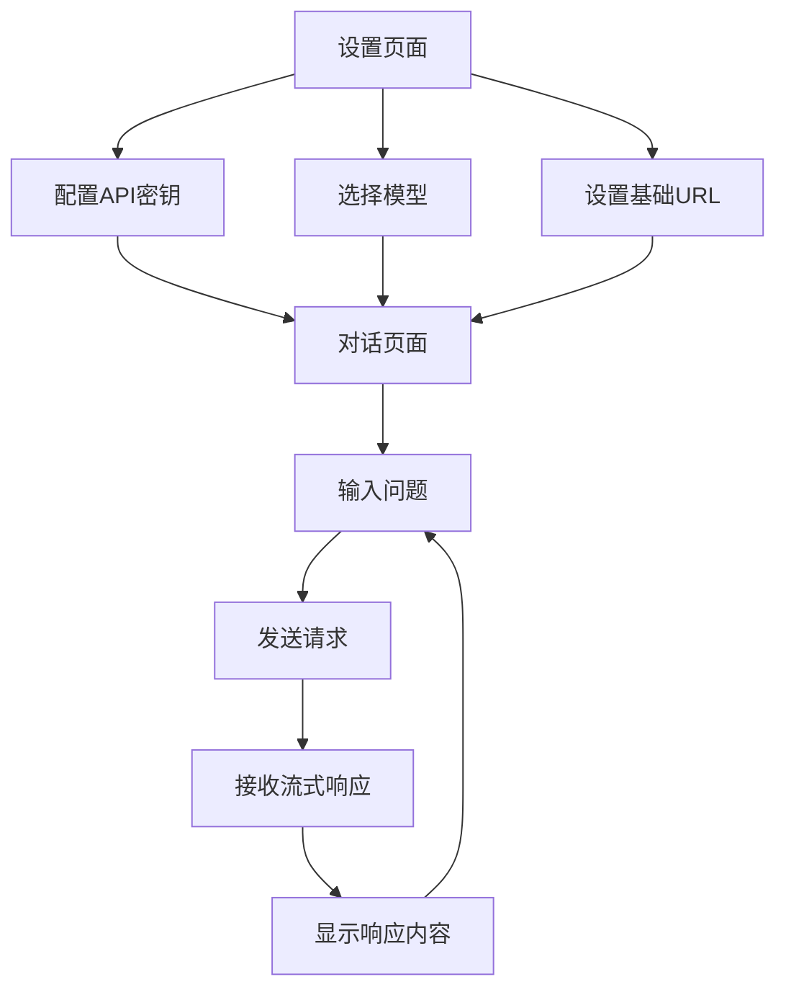

## 1. 产品概述
一个基于流式传输的AI对话Web应用，用户可配置API密钥和模型参数，实现与AI的实时对话交互。支持OpenAI兼容API，采用Server-Sent Events技术实现响应内容的实时显示。

目标用户：需要使用AI对话功能的技术人员和普通用户，提供简洁高效的对话体验。

## 2. 核心功能

### 2.1 用户角色
| 角色 | 注册方式 | 核心权限 |
|------|----------|----------|
| 普通用户 | 无需注册 | 配置API密钥、选择模型、进行对话 |

### 2.2 功能模块
应用包含以下主要页面：
1. **设置页面**：API密钥配置、模型选择、基础URL设置。
2. **对话页面**：实时聊天界面、消息展示、流式响应接收。

### 2.3 页面详情
| 页面名称 | 模块名称 | 功能描述 |
|----------|----------|----------|
| 设置页面 | API配置 | 输入和保存API密钥、选择AI模型（默认gpt-5-mini）、设置API基础URL |
| 设置页面 | 本地存储 | 自动保存用户配置到浏览器本地存储 |
| 对话页面 | 聊天界面 | 显示对话历史、支持Markdown格式渲染 |
| 对话页面 | 消息输入 | 文本输入框、发送按钮、清空对话功能 |
| 对话页面 | 流式响应 | 实时接收和显示AI响应内容、打字机效果 |
| 对话页面 | 错误处理 | 网络错误提示、API错误信息显示 |

## 3. 核心流程
用户操作流程：
1. 首次使用进入设置页面配置API密钥和模型参数
2. 配置完成后进入对话页面开始聊天
3. 输入问题并发送，实时接收AI响应
4. 可随时返回设置页面修改配置

## 4. 用户界面设计

### 4.1 设计风格
- **主色调**：深蓝色（#1e40af）和白色为主
- **按钮样式**：圆角矩形，悬停效果
- **字体**：系统默认字体，主要文字14-16px
- **布局风格**：卡片式布局，左右分栏设计
- **图标风格**：简洁线性图标

### 4.2 页面设计概述
| 页面名称 | 模块名称 | UI元素 |
|----------|----------|--------|
| 设置页面 | API配置表单 | 输入框样式、标签文字、保存按钮、重置按钮 |
| 对话页面 | 聊天窗口 | 消息气泡样式（用户右对齐、AI左对齐）、滚动区域、输入框固定在底部 |
| 对话页面 | 消息展示 | 支持Markdown语法高亮、代码块显示、链接可点击 |
| 对话页面 | 状态指示 | 加载动画、连接状态显示、错误提示样式 |

### 4.3 响应式设计
采用桌面端优先设计，适配不同屏幕尺寸：
- 桌面端：左右分栏布局，设置面板宽度300px
- 平板：响应式调整，保持可用性
- 手机：上下布局，设置面板变为底部抽屉

### 4.4 交互优化
- 支持Enter键发送消息，Shift+Enter换行
- 自动滚动到最新消息
- 输入框高度自适应
- 消息复制功能