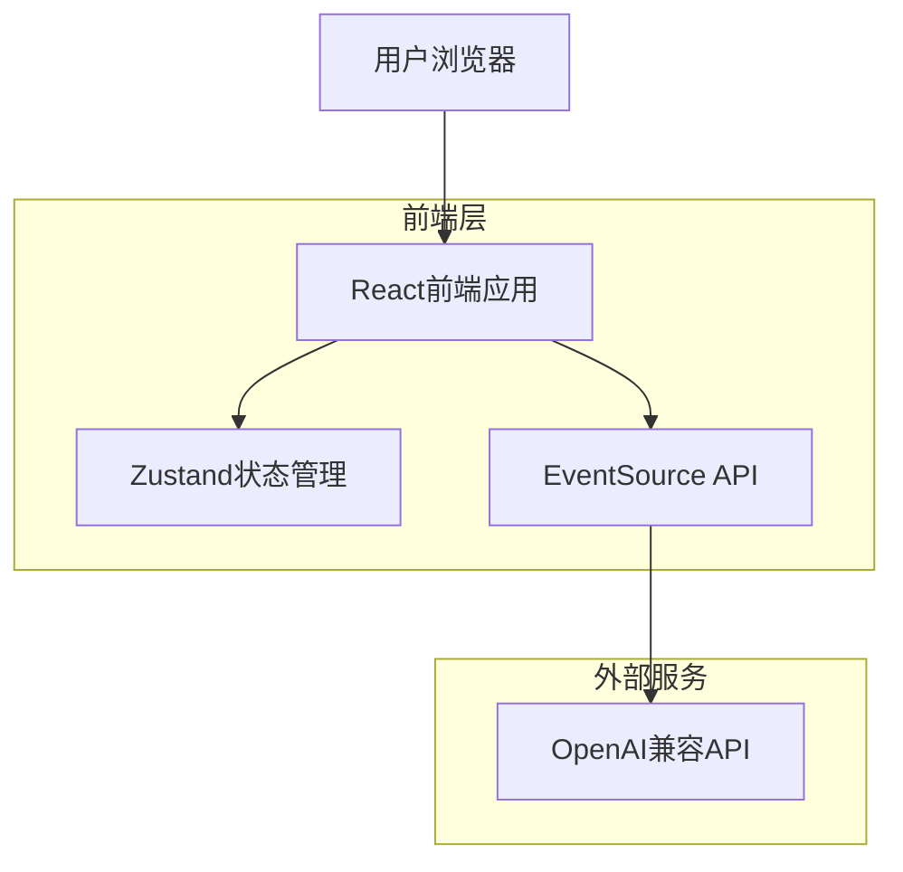
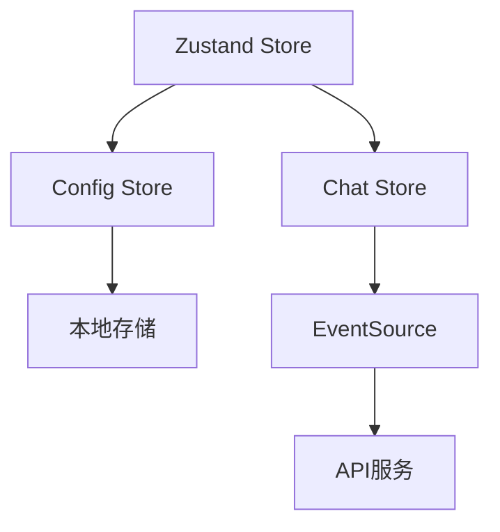

## 1. 架构设计



## 2. 技术描述

- **前端**：React@18 + TypeScript + Tailwind CSS
- **构建工具**：Vite (配置为 Solution-Style TSConfig)
- **状态管理**：Zustand
- **流式通信**：原生 Fetch + ReadableStream (非 EventSource，支持 POST)
- **Markdown渲染**：react-markdown + remark-gfm
- **代码高亮**：react-syntax-highlighter
- **后端**：无（纯客户端应用）

## 3. 路由定义

| 路由 | 用途 |
|------|------|
| / | 对话页面，主要的聊天界面 |
| /settings | 设置页面，配置API密钥和模型参数 |

## 4. 核心类型定义

### 4.1 消息类型
```typescript
interface Message {
  id: string;
  role: 'user' | 'assistant' | 'system';
  content: string;
  timestamp: number;
}

interface ChatState {
  messages: Message[];
  isLoading: boolean;
  error: string | null;
}
```

### 4.2 配置类型
```typescript
interface AppConfig {
  apiKey: string;
  model: string;
  baseUrl: string;
}

interface ConfigState {
  config: AppConfig;
  isConfigured: boolean;
}
```

### 4.3 SSE响应类型
```typescript
interface StreamChunk {
  choices: Array<{
    delta: {
      content?: string;
      role?: string;
    };
    finish_reason?: string;
  }>;
}
```

## 5. 状态管理架构



## 6. 数据模型

### 6.1 本地存储结构
```typescript
// 配置数据
interface LocalStorageData {
  appConfig: AppConfig;
  chatHistory?: Message[];
}
```

### 6.2 消息状态管理
```typescript
// 消息状态枚举
enum MessageStatus {
  PENDING = 'pending',
  SENT = 'sent',
  RECEIVING = 'receiving',
  ERROR = 'error'
}

// 扩展消息类型
interface ChatMessage extends Message {
  status: MessageStatus;
  error?: string;
}
```

## 7. 关键技术实现

### 7.1 SSE连接管理
- 使用 `fetch` API 发起 POST 请求
- 处理 `ReadableStream` 获取流式响应
- 手动解析 SSE 格式数据 (buffer处理)

### 7.2 流式数据处理
- 逐块解析SSE数据流
- 实时更新UI状态
- 消息缓冲和拼接处理

### 7.3 性能优化
- **渲染优化**: 使用 `React.memo` + 自定义对比函数，避免历史消息重绘
- **虚拟滚动**: (规划中) 针对超长对话列表的优化
- **防抖处理**: 用户输入防抖